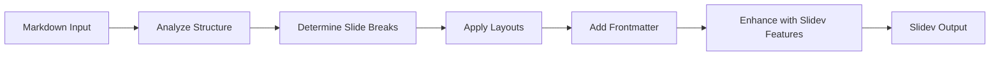

<div align="center">

# 🎯 Slidev Converter

### Convert Markdown to Slidev Presentations with AI

### 将 Markdown 转换为 Slidev 演示文稿

[](https://opensource.org/licenses/MIT)
[](https://sli.dev)

</div>

---

## 📖 About | 关于

**Slidev Converter** is a Claude Skill that transforms standard Markdown documents into beautiful [Slidev](https://sli.dev) presentations.

**Slidev Converter** 是一个 Claude 技能，可将标准 Markdown 文档转换为精美的 [Slidev](https://sli.dev) 演示文稿。

### ✨ Features | 特性

| Feature | 功能 | Description |
|---------|------|-------------|
| 🔄 **Auto Conversion** | 自动转换 | Transform Markdown to Slidev format instantly |
| 📐 **Smart Layouts** | 智能布局 | Automatically selects appropriate layouts |
| 🎨 **Syntax Support** | 语法支持 | Full Slidev syntax including animations & styling |
| 📚 **Reference Guide** | 参考指南 | Built-in complete syntax reference |
| 📄 **Template Included** | 附带模板 | Ready-to-use presentation template |

---

## 🚀 Quick Start | 快速开始

### Installation | 安装

1. **Clone or download this skill** | 克隆或下载此技能
2. **Import to Claude Code** or **Copy to your skills directory** | 导入 Claude Code 或复制到技能目录

### Usage | 使用

Simply ask Claude to convert your Markdown:

直接让 Claude 转换你的 Markdown：

```
"Convert this markdown to Slidev format: [your content]"
"把这段 markdown 转换为 Slidev 格式：[你的内容]"
```

```
"Turn my notes into a Slidev presentation"
"把我的笔记转换成 Slidev 演示文稿"
```

```
"Create slides from this markdown: [paste content]"
"用这段 markdown 创建幻灯片：[粘贴内容]"
```

---

## 📋 How It Works | 工作原理



### What It Does | 功能说明

- ✅ Separate slides with `---` syntax | 使用 `---` 语法分隔幻灯片
- ✅ Add appropriate frontmatter configurations | 添加适当的 frontmatter 配置
- ✅ Choose layouts based on content type | 根据内容类型选择布局
- ✅ Preserve code blocks with syntax highlighting | 保留带语法高亮的代码块
- ✅ Add click animations (`v-click`) where appropriate | 添加点击动画
- ✅ Apply CSS classes for styling | 应用 CSS 类进行样式设置

---

## 🎨 Layout Guide | 布局指南

| Content Type | 内容类型 | Recommended Layout |
|:-------------:|:---------:|:------------------:|
| 📄 Title/Cover | 标题/封面 | `layout: center` |
| 📝 Text + Code | 文字 + 代码 | `layout: two-cols` |
| 🖼️ Text + Image | 文字 + 图片 | `layout: image-right` |
| 📊 Bullet Points | 项目列表 | Default (no layout) |
| ⚖️ Comparison | 对比内容 | `layout: two-cols` |

---

## 📚 Syntax Quick Reference | 语法速查

### Page Separation | 分隔页面

```markdown
---
---

# Slide Title

Content

---
---

# Next Slide
```

### Frontmatter | 页面配置

```markdown
---
layout: two-cols
class: text-center
theme: seriph
---

# Content
```

### Click Animations | 点击动画

```markdown
<div v-click>Appears on click</div>

<v-clicks>
- Item 1
- Item 2
- Item 3
</v-clicks>
```

### Two Columns | 两栏布局

```markdown
---
layout: two-cols
---

## Left Column | 左栏

- Point A
- Point B

::right::

## Right Column | 右栏

Description or code
```

---

## 📂 Skill Structure | 技能结构

```
slidev-converter/
├── SKILL.md                    # Core instructions for Claude
├── README.md                   # This file
├── references/
│   └── slidev-syntax.md       # Complete syntax reference
└── assets/
    └── template.md            # Starter template
```

---

## 🔗 Resources | 资源链接

- [Slidev Official Documentation](https://sli.dev/guide/) | [Slidev 官方文档](https://sli.dev/guide/)
- [Slidev Syntax Guide](https://sli.dev/guide/syntax.html) | [Slidev 语法指南](https://sli.dev/guide/syntax.html)
- [Layout Reference](https://sli.dev/guide/layouts.html) | [布局参考](https://sli.dev/guide/layouts.html)
- [Theme Gallery](https://sli.dev/resources/theme-gallery) | [主题画廊](https://sli.dev/resources/theme-gallery)

---

## 📝 License | 许可证

MIT License - feel free to use and modify!

MIT 许可证 - 自由使用和修改！

---

<div align="center">

**Made with ❤️ for the Slidev community**

**为 Slidev 社区用 ❤️ 制作**

[⬆ Back to Top](#-slidev-converter) [⬆ 返回顶部](#-slidev-converter)

</div>
