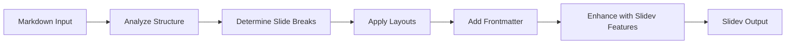

<div align="center">

# 🎯 Slidev Converter

### Convert Markdown to Slidev Presentations with AI

[](https://opensource.org/licenses/MIT)
[](https://sli.dev)

---

<details>
<summary><b>🌐 Language / 语言</b></summary>

Select language below:

[English](#english) | [简体中文](#chinese)

</details>

</div---

---

<a id="english"></a>

# 📖 About

**Slidev Converter** is a Claude Skill that transforms standard Markdown documents into beautiful [Slidev](https://sli.dev) presentations. It automatically handles slide separation, layout selection, and syntax conversion.

### ✨ Features

| Feature | Description |
|---------|-------------|
| 🔄 **Auto Conversion** | Transform Markdown to Slidev format instantly |
| 📐 **Smart Layouts** | Automatically selects appropriate layouts |
| 🎨 **Syntax Support** | Full Slidev syntax including animations & styling |
| 📚 **Reference Guide** | Built-in complete syntax reference |
| 📄 **Template Included** | Ready-to-use presentation template |

---

## 🚀 Quick Start

### Installation

1. Clone or download this skill
2. Import to Claude Code or copy to your skills directory

### Usage

Simply ask Claude to convert your Markdown:

```
"Convert this markdown to Slidev format: [your content]"
```

```
"Turn my notes into a Slidev presentation"
```

```
"Create slides from this markdown: [paste content]"
```

---

## 📋 How It Works



### What It Does

- �� Separate slides with `---` syntax
- ✅ Add appropriate frontmatter configurations
- ✅ Choose layouts based on content type
- ✅ Preserve code blocks with syntax highlighting
- ✅ Add click animations (`v-click`) where appropriate
- ✅ Apply CSS classes for styling

---

## 🎨 Layout Guide

| Content Type | Recommended Layout |
|:-------------:|:------------------:|
| 📄 Title/Cover | `layout: center` |
| 📝 Text + Code | `layout: two-cols` |
| 🖼️ Text + Image | `layout: image-right` |
| 📊 Bullet Points | Default (no layout) |
| ⚖️ Comparison | `layout: two-cols` |

---

## 📚 Syntax Quick Reference

### Page Separation

```markdown
---
---

# Slide Title

Content

---
---

# Next Slide
```

### Frontmatter

```markdown
---
layout: two-cols
class: text-center
theme: seriph
---

# Content
```

### Click Animations

```markdown
<div v-click>Appears on click</div>

<v-clicks>
- Item 1
- Item 2
- Item 3
</v-clicks>
```

### Two Columns

```markdown
---
layout: two-cols
---

## Left Column

- Point A
- Point B

::right::

## Right Column

Description or code
```

---

## 📂 Skill Structure

```
slidev-converter/
├── SKILL.md                    # Core instructions for Claude
├── README.md                   # This file
├── references/
│   └── slidev-syntax.md       # Complete syntax reference
└── assets/
    └── template.md            # Starter template
```

---

## 🔗 Resources

- [Slidev Official Documentation](https://sli.dev/guide/)
- [Slidev Syntax Guide](https://sli.dev/guide/syntax.html)
- [Layout Reference](https://sli.dev/guide/layouts.html)
- [Theme Gallery](https://sli.dev/resources/theme-gallery)

---

## 📝 License

MIT License - feel free to use and modify!

---

<div align="center">

**Made with ❤️ for the Slidev community**

[⬆ Back to Top](#-slidev-converter) | [🌐 简体中文](#chinese)

</div---

---

---

<a id="chinese"></a>

# 📖 简介

**Slidev Converter** 是一个 Claude 技能，可将标准 Markdown 文档转换为精美的 [Slidev](https://sli.dev) 演示文稿。它自动处理幻灯片分隔、布局选择和语法转换。

### ✨ 特性

| 特性 | 说明 |
|---------|-------------|
| 🔄 **自动转换** | 即刻将 Markdown 转换为 Slidev 格式 |
| 📐 **智能布局** | 自动选择合适的布局 |
| 🎨 **语法支持** | 完整的 Slidev 语法，包括动画和样式 |
| 📚 **参考指南** | 内置完整的语法参考 |
| 📄 **附带模板** | 即用的演示文稿模板 |

---

## 🚀 快速开始

### 安装

1. 克隆或下载此技能
2. 导入 Claude Code 或复制到你的技能目录

### 使用

直接让 Claude 转换你的 Markdown：

```
"把这段 markdown 转换为 Slidev 格式：[你的内容]"
```

```
"把我的笔记转换成 Slidev 演示文稿"
```

```
"用这段 markdown 创建幻灯片：[粘贴内容]"
```

---

## 📋 工作原理


### 功能说明

- ✅ 使用 `---` 语法分隔幻灯片
- ✅ 添加适当的 frontmatter 配置
- ✅ 根据内容类型选择布局
- ✅ 保留带语法高亮的代码块
- ✅ 添加点击动画 (`v-click`)
- ✅ 应用 CSS 类进行样式设置

---

## 🎨 布局指南

| 内容类型 | 推荐布局 |
|:-------------:|:------------------:|
| 📄 标题/封面 | `layout: center` |
| 📝 文字 + 代码 | `layout: two-cols` |
| 🖼️ 文字 + 图片 | `layout: image-right` |
| 📊 项目列表 | 默认（无需布局） |
| ⚖️ 对比内容 | `layout: two-cols` |

---

## 📚 语法速查

### 分隔页面

```markdown
---
---

# 幻灯片标题

内容

---
---

# 下一页
```

### 页面配置

```markdown
---
layout: two-cols
class: text-center
theme: seriph
---

# 内容
```

### 点击动画

```markdown
<div v-click>点击后显示</div>

<v-clicks>
- 项目 1
- 项目 2
- 项目 3
</v-clicks>
```

### 两栏布局

```markdown
---
layout: two-cols
---

## 左栏

- 要点 A
- 要点 B

::right::

## 右栏

描述或代码
```

---

## 📂 技能结构

```
slidev-converter/
├── SKILL.md                    # Claude 的核心指令
├── README.md                   # 本文件
├── references/
│   └── slidev-syntax.md       # 完整语法参考
└── assets/
    └── template.md            # 初始模板
```

---

## 🔗 资源链接

- [Slidev 官方文档](https://sli.dev/guide/)
- [Slidev 语法指南](https://sli.dev/guide/syntax.html)
- [布局参考](https://sli.dev/guide/layouts.html)
- [主题画廊](https://sli.dev/resources/theme-gallery)

---

## 📝 许可证

MIT 许可证 - 自由使用和修改！

---

<div align="center">

**为 Slidev 社区用 ❤️ 制作**

[⬆ 返回顶部](#-slidev-converter) | [🌐 English](#english)

</div---
