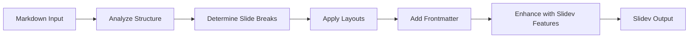

<div align="center">

# 🎯 Slidev Converter

### Convert Markdown to Slidev Presentations with AI

[](https://opensource.org/licenses/MIT)
[](https://sli.dev)

</div>

---

## 📖 About

**Slidev Converter** is a Claude Skill that transforms standard Markdown documents into beautiful [Slidev](https://sli.dev) presentations. It automatically handles slide separation, layout selection, and syntax conversion.

### ✨ Features

| Feature | Description |
|---------|-------------|
| 🔄 **Auto Conversion** | Transform Markdown to Slidev format instantly |
| 📐 **Smart Layouts** | Automatically selects appropriate layouts |
| 🎨 **Syntax Support** | Full Slidev syntax including animations & styling |
| 📚 **Reference Guide** | Built-in complete syntax reference |
| 📄 **Template Included** | Ready-to-use presentation template |

---

## 🚀 Quick Start

### Installation

1. **Clone or download this skill**
2. **Import to Claude Code** or **Copy to your skills directory**

### Usage

Simply ask Claude to convert your Markdown:

```
"Convert this markdown to Slidev format: [your content]"
```

```
"Turn my notes into a Slidev presentation"
```

```
"Create slides from this markdown: [paste content]"
```

---

## 📋 How It Works



### The Skill Does:

- ✅ Separate slides with `---` syntax
- ✅ Add appropriate frontmatter configurations
- ✅ Choose layouts based on content type
- ✅ Preserve code blocks with syntax highlighting
- ✅ Add click animations (`v-click`) where appropriate
- ✅ Apply CSS classes for styling

---

## 🎨 Layout Guide

| Content Type | Recommended Layout |
|:-------------:|:------------------:|
| 📄 Title/Cover | `layout: center` |
| 📝 Text + Code | `layout: two-cols` |
| 🖼️ Text + Image | `layout: image-right` |
| 📊 Bullet Points | Default (no layout) |
| ⚖️ Comparison | `layout: two-cols` |

---

## 📚 Slidev Syntax Quick Reference

### Page Separation

```markdown
---
---

# Slide Title

Content

---
---

# Next Slide
```

### Frontmatter

```markdown
---
layout: two-cols
class: text-center
theme: seriph
---

# Content
```

### Click Animations

```markdown
<div v-click>Appears on click</div>

<v-clicks>
- Item 1
- Item 2
- Item 3
</v-clicks>
```

### Two Columns

```markdown
---
layout: two-cols
---

## Left Column

- Point A
- Point B

::right::

## Right Column

Description or code
```

---

## 📂 Skill Structure

```
slidev-converter/
├── SKILL.md                    # Core instructions for Claude
├── README.md                   # This file
├── references/
│   └── slidev-syntax.md       # Complete syntax reference
└── assets/
    └── template.md            # Starter template
```

---

## 🎯 Example

### Input (Standard Markdown)

```markdown
# My Presentation

## Introduction

Welcome to this presentation about...

## Features

- Feature 1
- Feature 2
- Feature 3

## Code Example

function hello() {
  console.log("Hello World");
}
```

### Output (Slidev Format)

```markdown
---
theme: seriph
class: text-center
---

# My Presentation

<div class="mt-10">
  Welcome to this presentation
</div>

---
---

# Introduction

Welcome to this presentation about...

---
---

# Features

<v-clicks>

- Feature 1
- Feature 2
- Feature 3

</v-clicks>

---
layout: two-cols
---

# Code Example

::right::

```js
function hello() {
  console.log("Hello World");
}
```
```

---

## 🔗 Resources

- [Slidev Official Documentation](https://sli.dev/guide/)
- [Slidev Syntax Guide](https://sli.dev/guide/syntax.html)
- [Layout Reference](https://sli.dev/guide/layouts.html)
- [Theme Gallery](https://sli.dev/resources/theme-gallery)

---

## 📝 License

MIT License - feel free to use and modify!

---

<div align="center">

**Made with ❤️ for the Slidev community**

[⬆ Back to Top](#-slidev-converter)

</div>
