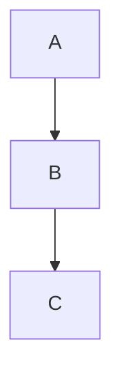

# Slidev Converter

## Overview

Convert standard Markdown documents into Slidev presentation format. Slidev is a developer-focused presentation tool that uses Markdown with special syntax for slides, layouts, and interactivity. It supports Vue components, animations, LaTeX math, Mermaid diagrams, and extensive customization.

## When to Use

Trigger this skill when users ask to:
- "Convert markdown to slides" or "Turn markdown into a presentation"
- "Create Slidev from markdown" or "Transform notes to Slidev format"
- "Make a presentation from this markdown"
- "Format this as Slidev"

Do NOT use for:
- Converting to PowerPoint, Keynote, or other slide formats (use pptx skill instead)
- General markdown formatting questions

## Core Conversion Rules

### 1. Page Separation

Use `---` to separate each slide:

```markdown
---
---

# Slide 1 Title

Content

---
---

# Slide 2 Title

Content
```

**Critical:** Each `---` must be on its own line. For pages without configuration, use double `---` with nothing between them.

### 2. Frontmatter (Page Configuration)

Place configuration BETWEEN two `---` markers:

```markdown
---
layout: two-cols
class: text-center
---

# Slide Content
```

### 3. Content vs. Configuration

- **Above first `---`**: Previous page content
- **Between `---` pairs**: Current page configuration
- **Below second `---`**: Current page content

### 4. Header to Slide Mapping

- `#` becomes slide title (main heading)
- `##` becomes section heading
- Consider each major section as a potential new slide

### 5. Code Blocks

Preserve code blocks with proper syntax highlighting and line highlighting:

```markdown
```js {1-2|4|all}
function hello() {
  console.log("Hello World")  // Highlight lines 1-2
  return true                 // Then highlight line 4
}
```
```

### 6. Lists

Convert nested lists into appropriate slide layouts. Consider using `v-clicks` for step-by-step reveal:

```markdown
<v-clicks>

- Item 1 (click to reveal)
- Item 2 (click to reveal)
- Item 3 (click to reveal)

</v-clicks>
```

## Layout Guidelines

### Complete Built-in Layouts

| Layout | Description | Use Case |
|--------|-------------|----------|
| `default` | Standard layout | General content |
| `center` | Centered content | Title slides, quotes |
| `cover` | Cover page | Opening slide |
| `intro` | Introduction page | Presentation start |
| `section` | Section divider | Between major sections |
| `two-cols` | Two column layout | Text + code, comparisons |
| `image-left` | Image on left | Visual + explanation |
| `image-right` | Image on right | Explanation + visual |
| `image` | Full screen image | Full-screen visuals |
| `iframe` | Embedded webpage | Live demos, websites |
| `quote` | Quote layout | Testimonials, quotes |
| `end` | Ending page | Closing, Q&A |

### Layout Examples

**Two Columns (Text + Code):**
```markdown
---
layout: two-cols
---

# Left Column

- Point 1
- Point 2

::right::

```js
// Right column code
console.log("code")
```
```

**Image + Text:**
```markdown
---
layout: image-right
image: https://example.com/image.jpg
---

# Title

Text on the left, image on the right
```

**Iframe (Embedded Content):**
```markdown
---
layout: iframe
url: https://example.com
---

# Live Demo
```

## Conversion Workflow

1. **Analyze source structure**: Identify main sections, headers, and content blocks
2. **Determine slide breaks**: Each major section or `#` header typically becomes a new slide
3. **Apply layouts**: Choose appropriate layouts based on content type
4. **Add frontmatter**: Insert configuration for slides needing special layouts
5. **Enhance with Slidev features**: Add animations, components, styling
6. **Validate**: Ensure all `---` pairs are correct and frontmatter is properly formatted

## Slidev Syntax Quick Reference

### Basic Elements

| Element | Syntax |
|---------|--------|
| Bold | `**text**` |
| Italic | `*text*` |
| Strikethrough | `~~text~~` |
| Inline code | `` `code` `` |
| Links | `[text](url)` |
| Images | `` or `` |
| Tables | Standard Markdown table syntax |

### Animations

**v-click (Appear on click):**
```markdown
<div v-click>
Appears on first click
</div>

<div v-click="2">
Appears on second click
</div>

<v-clicks>
- Item 1
- Item 2
- Item 3
</v-clicks>
```

**v-after (After previous element):**
```markdown
<div v-after>
Appears after previous animation
</div>
```

**v-mark (Text marking):**
```markdown
<span v-mark.red>Red underline</span>
<span v-mark.circle="3">Circle on 3rd click</span>
<span v-mark.underline.blue>Blue underline</span>
```

**v-motion (Motion animations):**
```markdown
<div
  v-motion
  :initial="{ x: -80, opacity: 0 }"
  :enter="{ x: 0, opacity: 1 }">
  Animated content
</div>
```

### Built-in Components

**Toc (Table of Contents):**
```html
<Toc minDepth="1" maxDepth="2" />
```

**Link with preview:**
```html
<Link href="https://example.com" card />
```

**Colored Titles:**
```html
<Title>
  <span class="text-red-500">Red</span> Title
</Title>
```

### Images

```markdown
<!-- Basic -->


<!-- With positioning -->


<!-- Multiple images grid -->
<div grid="~ cols-2 gap-4">
  
  
</div>
```

### LaTeX Math

Inline: `$\sqrt{3x-1}$`

Block:
```markdown
$$
\begin{aligned}
a &= b + c \\
d &= e + f
\end{aligned}
$$
```

### Mermaid Diagrams

```markdown

```

### Speaker Notes

```markdown
<!--
Speaker notes only visible in presenter mode
-->
```

## CSS Classes (UnoCSS)

Common utility classes:

**Text:**
- Size: `text-xs`, `text-sm`, `text-base`, `text-lg`, `text-xl`, `text-2xl`, `text-4xl`, `text-6xl`
- Alignment: `text-left`, `text-center`, `text-right`
- Weight: `font-thin`, `font-light`, `font-normal`, `font-bold`
- Color: `text-red-500`, `text-blue-400`, `text-green-600`

**Spacing:**
- Margin: `m-4`, `mt-10`, `mb-5`, `ml-8`, `mr-8`
- Padding: `p-4`, `px-10`, `py-5`

**Layout:**
- Grid: `grid`, `grid-cols-2`, `grid-cols-3`, `gap-4`
- Flex: `flex`, `flex-col`, `justify-center`, `items-center`
- Size: `w-full`, `w-1/2`, `w-60`, `h-40`

**Effects:**
- `rounded`, `rounded-full`
- `shadow`, `shadow-lg`, `shadow-xl`
- `opacity-50`, `opacity-80`

**Positioning:**
- `absolute`, `relative`, `fixed`
- `top-0`, `bottom-10`, `left-10`, `right-10`

## Global Frontmatter Options

```yaml
---
# Theme
theme: seriph
colorSchema: 'light'  # or 'dark', 'auto'

# Appearance
title: Presentation Title
titleTemplate: '%s - My Presentation'
class: text-center

# Layouts
layout: cover
layoutClass: 'text-center'

# Drawings
drawings:
  persist: false
  presenterOnly: true

# Export
exportFilename: slidev-export
export:
  format: pdf
  timeout: 30000
  withClicks: false

# Fonts
fonts:
  sans: 'Roboto'
  serif: 'Merriweather'
  mono: 'Fira Code'

# Highlight
highlighter: shiki  # or 'prism'
lineNumbers: false

# Information
info: false
transition: slide-left  # fade, slide-left, slide-right, etc.
presenter: dev

# Monaco Editor (for live editing)
monaco: 'dev'  # or 'enabled'

# Diagrams
katex: true
mermaid: true

# Icons
icons: mdi
---
```

## Per-Slide Frontmatter

```yaml
---
# Layout
layout: center
class: text-center

# Transition
transition: slide-left

# Background
background: '/bg.jpg'
backgroundSize: cover
backgroundColor: '#ff0000'

# Image (for image-left/right layouts)
image: /image.jpg
imageClass: w-60

# Iframe
layout: iframe
url: https://example.com

# Export control
export: false  # Exclude from export

# Preview mode
preview: false  # Exclude from preview
---
```

## Slide Transition Options

- `slide-left` - Slide from left
- `slide-right` - Slide from right
- `slide-up` - Slide from up
- `slide-down` - Slide from down
- `fade` - Fade in
- `fade-out` - Fade out
- `view-transition` - View transition API

## Advanced Features

### Global Context ($slidev)

Access global state in components:
```javascript
$slidev.nav.clicks    // Current click count
$slidev.nav.currentLayout  // Current layout name
$slidev.theme         // Theme configuration
```

### Custom Components

Create `components/MyComponent.vue`:
```vue
<template>
  <div class="my-component">
    <slot />
  </div>
</template>
```

### Static Assets

- Place images in `public/` folder
- Reference as `/image.png`
- Or use `./slides/` relative paths

## Best Practices

1. **Keep slides focused**: One main idea per slide
2. **Use layouts wisely**: Don't force complex layouts when simple will do
3. **Preserve code integrity**: Keep code blocks intact with proper language tags
4. **Add animations sparingly**: Use `v-click` for emphasis, not for everything
5. **Test structure**: Ensure all `---` pairs are properly closed
6. **Use speaker notes**: Add context for presentation mode
7. **Consider export**: Ensure slides work when exported to PDF

## Common Themes

- `default` - Minimalist theme
- `seriph` - Serif font theme
- `apple-basic` - Apple-style
- `shibainu` - Cute dog theme
- `unicorn` - Colorful theme

## Export Options

```bash
# PDF
npm run export

# PPTX
npm run export -- --format pptx

# PNG (single slides)
npm run export -- --format png

# Speaker notes PDF
npm run export -- --with-clicks
```

## Deployment

Supported platforms:
- **Netlify**: Auto-deploy from git
- **Vercel**: Zero-config deployment
- **GitHub Pages**: Free static hosting
- **Cloudflare Pages**: Global CDN

## Resources

- Slidev official documentation: https://sli.dev/guide/
- Syntax guide: https://sli.dev/guide/syntax.html
- Layout reference: https://sli.dev/guide/layouts.html
- Theme gallery: https://sli.dev/resources/theme-gallery
- Built-in components: https://sli.dev/guide/built-ins.html
