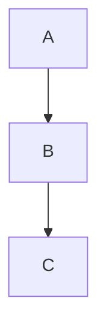

# Slidev Syntax Reference

Complete reference for Slidev presentation syntax.

## Page Separation

```
--- separates slides

---

# Slide 1
content

---

# Slide 2
content
```

## Frontmatter Options

```yaml
---
theme: seriph              # Theme: default, seriph, apple-basic, etc.
layout: center             # Layout: center, two-cols, image-right, etc.
class: text-center         # CSS classes for styling
transition: slide-left     # Slide transition effect
background: url(...)       # Background image
presenter: dev             # Enable presenter mode
drawings:
  persist: false          # Save drawings
---
```

## Available Layouts

| Layout | Description |
|--------|-------------|
| `default` | Standard layout |
| `center` | Centered content |
| `two-cols` | Two column layout |
| `image-left` | Image on left |
| `image-right` | Image on right |
| `image` | Full screen image |
| `cover` | Cover page |
| `intro` | Introduction page |
| `section` | Section divider |
| `quote` | Quote layout |
| `end` | Ending page |

## Built-in Components

### Toc (Table of Contents)
```html
<Toc minDepth="1" maxDepth="2" />
```

### YouTube
```html
<Youtube id="video_id" />
```

### Tweet
```html
<Tweet id="tweet_id" />
```

## Directives

### v-click - Click Animations
```html
<div v-click>Shows on click</div>
<div v-click="2">Shows on 2nd click</div>

<v-clicks>
- Item 1
- Item 2
</v-clicks>
```

### v-mark - Text Marking
```html
<span v-mark.red>Red underline</span>
<span v-mark.circle="3">Circle on 3rd click</span>
<span v-mark.underline.blue>Blue underline</span>
```

### v-motion - Motion Animations
```html
<div
  v-motion
  :initial="{ x: -80 }"
  :enter="{ x: 0 }">
  Animated content
</div>
```

## UnoCSS Classes

Common utility classes:

**Text:**
- `text-sm`, `text-base`, `text-xl`, `text-2xl`, `text-4xl`, `text-6xl`
- `text-left`, `text-center`, `text-right`
- `font-bold`, `font-light`, `font-thin`
- `text-red-500`, `text-blue-400`, `text-green-600`

**Spacing:**
- `m-4`, `mt-10`, `mb-5`, `ml-8`, `mr-8`
- `p-4`, `px-10`, `py-5`

**Layout:**
- `grid`, `grid-cols-2`, `grid-cols-3`
- `flex`, `flex-col`, `justify-center`, `items-center`
- `w-full`, `w-1/2`, `w-60`, `h-40`

**Effects:**
- `rounded`, `rounded-full`
- `shadow`, `shadow-lg`
- `opacity-50`, `opacity-80`

**Positioning:**
- `absolute`, `relative`, `fixed`
- `top-0`, `bottom-10`, `left-10`, `right-10`
- `absolute top-1/2 left-1/2 transform`

## Code Blocks

```markdown
```js {1-2|4|all}
function hello() {
  console.log("Hi")
  return true
}
```
```

Line highlighting: `{lines}` syntax
- `{1}` - highlight line 1
- `{1-3}` - highlight lines 1-3
- `{1|2|3}` - step through lines
- `{all}` - highlight all

## Images

```markdown
<!-- Basic -->


<!-- With class -->


<!-- Absolute positioned -->


<!-- Grid -->
<div grid="~ cols-2 gap-4">
  
  
</div>
```

## Tables

```markdown
| Header 1 | Header 2 |
|----------|----------|
| Cell 1   | Cell 2   |
```

## LaTeX Math

Inline: `$\sqrt{3x-1}$`

Block:
```markdown
$$
\begin{aligned}
a &= b + c \\
d &= e + f
\end{aligned}
$$
```

## Mermaid Diagrams

```markdown

```

## Speaker Notes

```markdown
<!--
These are speaker notes
Only visible in presenter mode
-->
```

## Slide Transition Options

- `slide-left` - Slide from left
- `slide-right` - Slide from right
- `slide-up` - Slide from up
- `slide-down` - Slide from down
- `fade` - Fade in
- `fade-out` - Fade out
- `view-transition` - View transition API
