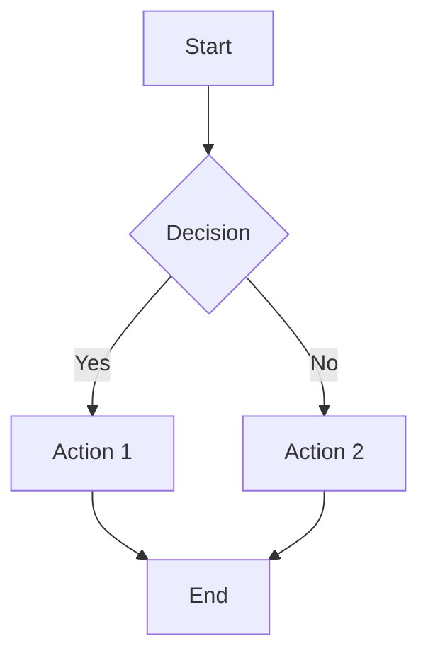

# Slidev Syntax Reference

Complete reference for Slidev presentation syntax.

## Page Separation

```
--- separates slides

---

# Slide 1
content

---

# Slide 2
content
```

## Frontmatter Options

### Global Frontmatter (First Slide)

```yaml
---
# Theme Configuration
theme: seriph                    # Theme name
colorSchema: 'light'             # 'light', 'dark', or 'auto'

# Presentation Info
title: Presentation Title
titleTemplate: '%s - My Pres'    # Title suffix template
info: false                      # Show info bar

# Layout & Style
layout: cover                    # Default layout
class: text-center               # CSS classes
layoutClass: 'text-center'       # Layout-specific classes

# Transitions
transition: slide-left           # Global transition

# Drawings
drawings:
  persist: false                 # Save drawings
  presenterOnly: true            # Only in presenter mode

# Export Settings
exportFilename: slidev-export
export:
  format: pdf
  timeout: 30000
  withClicks: false
  dark: false
  output: ./export-snapshot

# Fonts
fonts:
  sans: 'Roboto'
  serif: 'Merriweather'
  mono: 'Fira Code'
  weights: ['200', '400', '600']

# Code Highlighting
highlighter: shiki               # 'shiki' or 'prism'
lineNumbers: false               # Show line numbers
codeCopy: true                   # Copy button on code blocks

# Diagrams & Math
katex: true                      # LaTeX math
mermaid: true                    # Mermaid diagrams

# Editor
monaco: 'dev'                    # Monaco editor: 'dev', 'enabled', 'disabled'
monacoEditorOptions:
  theme: 'vs-dark'

# Icons
icons: mdi                       # Icon set: mdi, mdi-v5, etc.

# Downloadable Files
download: true                   # Enable slide download
---
```

### Per-Slide Frontmatter

```yaml
---
# Layout
layout: center
class: text-center

# Transition
transition: fade
transitionDuration: 500

# Background
background: '/bg.jpg'            # Image URL
backgroundSize: cover            # CSS background-size
backgroundColor: '#ff0000'       # Solid color
backgroundOpacity: 0.5           # For overlays

# Image Layouts
image: /image.jpg                # For image-left/right
imageClass: w-60 rounded         # Image CSS classes

# Iframe Layout
layout: iframe
url: https://example.com

# Visibility
export: false                    # Exclude from PDF export
preview: false                   # Exclude from preview mode

# Level Control
level: 2                         # TOC heading level
---
```

## Available Layouts

| Layout | Description | Frontmatter Options |
|--------|-------------|---------------------|
| `default` | Standard layout | None |
| `center` | Centered content | None |
| `cover` | Cover page | None |
| `intro` | Introduction page | None |
| `section` | Section divider | None |
| `two-cols` | Two columns | None |
| `image-left` | Image on left | `image`, `imageClass` |
| `image-right` | Image on right | `image`, `imageClass` |
| `image` | Full screen image | `image`, `imageClass` |
| `iframe` | Embedded webpage | `url` |
| `quote` | Quote layout | None |
| `end` | Ending page | None |

### Two Columns Layout

```markdown
---
layout: two-cols
---

## Left Column

- Point A
- Point B
- Point C

::right::

## Right Column

Description or code:

```js
function example() {
  return "hello"
}
```
```

## Built-in Components

### Toc (Table of Contents)

```html
<!-- Basic -->
<Toc />

<!-- With depth control -->
<Toc minDepth="1" maxDepth="2" />

<!-- With list style -->
<Toc listClass="text-xl" />

<!-- Exclude specific levels -->
<Toc maxDepth="1" />
```

### Link with Preview

```html
<!-- Basic link -->
<Link href="https://example.com">Visit site</Link>

<!-- With card preview -->
<Link href="https://example.com" card />

<!-- Custom title -->
<Link href="https://example.com" title="Custom Title" />
```

### Colored Titles

```html
<Title>
  <span class="text-red-500">Important</span> Title
</Title>
```

### Twitter / Tweet

```html
<Tweet id="20" />
```

### YouTube

```html
<Youtube id="video_id" />
```

## Directives

### v-click - Click Animations

```html
<!-- Single click -->
<div v-click>Shows on first click</div>

<!-- Delayed clicks -->
<div v-click="2">Shows on second click</div>
<div v-click="3">Shows on third click</div>

<!-- Hide after click -->
<div v-click-hide="2">Hidden after second click</div>
```

### v-clicks - List Animations

```html
<v-clicks>
- Item 1
- Item 2
- Item 3
</v-clicks>

<!-- With custom timing -->
<v-clicks at="2+3">
- Item 1 (appears at click 2)
- Item 2 (appears at click 3)
</v-clicks>

<!-- Hide mode -->
<v-clicks hide>
- Item 1 (hidden on first click)
- Item 2 (hidden on second click)
</v-clicks>
```

### v-after - Sequential Animations

```html
<div v-after>
  Appears after previous element's animation
</div>

<div v-after="2">
  Appears 2 steps after previous element
</div>
```

### v-mark - Text Marking

```html
<!-- Color underline -->
<span v-mark.red>Red underline</span>
<span v-mark.blue="2">Blue underline on click 2</span>

<!-- Circle -->
<span v-mark.circle>Circle around text</span>
<span v-mark.circle.red="3">Red circle on click 3</span>

<!-- Underline style -->
<span v-mark.underline>Underlined text</span>
<span v-mark.underline.green>Green underline</span>

<!-- Custom color -->
<span v-mark="'#ff0000'">Custom color</span>
```

### v-motion - Motion Animations

```html
<!-- Basic motion -->
<div
  v-motion
  :initial="{ x: -80, opacity: 0 }"
  :enter="{ x: 0, opacity: 1 }">
  Animated content
</div>

<!-- Preset motions -->
<div v-motion-slide-left>Slides from left</div>
<div v-motion-slide-right>Slides from right</div>
<div v-motion-slide-up>Slides from top</div>
<div v-motion-slide-down>Slides from bottom</div>
<div v-motion-fade>Fades in</div>

<!-- With delay -->
<div
  v-motion
  :initial="{ opacity: 0 }"
  :enter="{ opacity: 1, transition: { delay: 200 } }">
  Delayed fade in
</div>
```

### v-bind - Dynamic Binding

```html
<div v-bind="classBindings">Dynamic classes</div>
```

## Code Blocks

### Syntax Highlighting

````markdown
```javascript {1-2|4|all}
function hello() {
  console.log("Hi")     // Highlighted initially
  return true           // Highlighted on click 1
}
// This line highlighted on click 2
// All lines highlighted on click 3
```
````

### Line Highlighting Syntax

- `{1}` - Highlight line 1
- `{1-3}` - Highlight lines 1-3
- `{1,3,5}` - Highlight specific lines
- `{1|2|3}` - Step through lines (1, then 2, then 3)
- `{1-2|3-4|all}` - Combined: 1-2, then 3-4, then all
- `{none}` - No highlighting

### Code Block Configuration

````markdown
```ts {monaco}
// Editable with Monaco editor
const x = 1
```
````

````markdown
```ts {nitro}
// Active on the server
console.log('Server side')
```
````

````markdown
```ts {exec}
// Auto-run on slide change
console.log('Auto executed')
```
````

## UnoCSS Classes

### Text

**Size:**
- `text-xs`, `text-sm`, `text-base`, `text-lg`, `text-xl`
- `text-2xl`, `text-3xl`, `text-4xl`, `text-5xl`, `text-6xl`, `text-7xl`, `text-8xl`, `text-9xl`

**Alignment:**
- `text-left`, `text-center`, `text-right`, `text-justify`

**Weight:**
- `font-thin`, `font-extralight`, `font-light`, `font-normal`
- `font-medium`, `font-semibold`, `font-bold`, `font-extrabold`, `font-black`

**Color:**
- `text-white`, `text-black`
- `text-gray-{50-900}`
- `text-red-{50-900}`, `text-blue-{50-900}`, `text-green-{50-900}`
- `text-yellow-{50-900}`, `text-purple-{50-900}`, `text-pink-{50-900}`

### Spacing

**Margin:**
- `m-{0}` to `m-96`
- `mx-{auto|0-96}`, `my-{0-96}`
- `mt-{0-96}`, `mb-{0-96}`, `ml-{0-96}`, `mr-{0-96}`

**Padding:**
- `p-{0-96}`
- `px-{0-96}`, `py-{0-96}`
- `pt-{0-96}`, `pb-{0-96}`, `pl-{0-96}`, `pr-{0-96}`

### Layout

**Display:**
- `block`, `inline-block`, `inline`, `flex`, `inline-flex`, `grid`, `hidden`

**Flex:**
- `flex-row`, `flex-col`, `flex-row-reverse`, `flex-col-reverse`
- `wrap`, `nowrap`, `wrap-reverse`
- `justify-start`, `justify-end`, `justify-center`, `justify-between`, `justify-around`
- `items-start`, `items-end`, `items-center`, `items-baseline`, `items-stretch`

**Grid:**
- `grid`, `grid-cols-{1-12}`, `grid-rows-{1-6}`
- `gap-{0-96}`, `gap-x-{0-96}`, `gap-y-{0-96}`

**Size:**
- `w-auto`, `w-full`, `w-screen`, `w-min`, `w-max`, `w-fit`
- `w-{1/2}`, `w-{1/3}`, `w-{2/3}`, `w-{1/4}`, `w-{3/4}`, etc.
- `w-{0-96}` (arbitrary units)
- `h-auto`, `h-full`, `h-screen`, `h-{0-96}`

### Effects

**Border Radius:**
- `rounded-none`, `rounded-sm`, `rounded`, `rounded-md`, `rounded-lg`
- `rounded-xl`, `rounded-2xl`, `rounded-3xl`, `rounded-full`

**Shadow:**
- `shadow-none`, `shadow-sm`, `shadow`, `shadow-md`, `shadow-lg`, `shadow-xl`, `shadow-2xl`

**Opacity:**
- `opacity-0` to `opacity-100`

### Positioning

- `static`, `fixed`, `absolute`, `relative`, `sticky`
- `inset-{0-96}`, `top-{0-96}`, `bottom-{0-96}`, `left-{0-96}`, `right-{0-96}`

## Images

```markdown
<!-- Basic -->


<!-- With dimensions -->


<!-- HTML with classes -->


<!-- Absolute positioned -->


<!-- Grid layout -->
<div grid="~ cols-2 gap-4">
  
  
</div>

<!-- With click animation -->
<div v-click>
  
</div>
```

## Tables

```markdown
| Header 1 | Header 2 | Header 3 |
|----------|----------|----------|
| Cell 1   | Cell 2   | Cell 3   |
| Cell 4   | Cell 5   | Cell 6   |

| Left | Center | Right |
|:-----|:------:|------:|
| A    | B      | C     |
```

## LaTeX Math

### Inline Math

```markdown
The formula is $E = mc^2$.

Square root: $\sqrt{3x-1}$

Fraction: $\frac{a}{b}$
```

### Block Math

```markdown
$$
\begin{aligned}
a &= b + c \\
d &= e + f
\end{aligned}
$$

$$
\int_{0}^{\infty} e^{-x^2} dx = \frac{\sqrt{\pi}}{2}
$$
```

### Common LaTeX Commands

```markdown
- Superscript: $x^{2}$
- Subscript: $x_{i}$
- Fraction: $\frac{a}{b}$
- Square root: $\sqrt{x}$
- Sum: $\sum_{i=1}^{n} x_{i}$
- Product: $\prod_{i=1}^{n} x_{i}$
- Integral: $\int_{a}^{b} f(x) dx$
- Matrix: $\begin{pmatrix} a & b \\ c & d \end{pmatrix}$
```

## Mermaid Diagrams

```markdown

```

### Mermaid Diagram Types

```markdown
<!-- Flowchart -->
graph LR
  A --> B

<!-- Sequence Diagram -->
sequenceDiagram
  Alice->>Bob: Hello
  Bob-->>Alice: Hi

<!-- Class Diagram -->
classDiagram
  Animal <|-- Duck

<!-- State Diagram -->
stateDiagram-v2
  [*] --> Active

<!-- Entity Relationship -->
erDiagram
  CUSTOMER ||--o{ ORDER : places

<!-- User Journey -->
journey
  title My day
  Go to work: 5: Me
```

## Speaker Notes

```markdown
<!--
These are speaker notes
Only visible in presenter mode
Press 'p' to enter presenter mode
-->

Content visible to everyone
```

## Slide Transition Options

| Transition | Description |
|------------|-------------|
| `slide-left` | Slide from left |
| `slide-right` | Slide from right |
| `slide-up` | Slide from top |
| `slide-down` | Slide from bottom |
| `fade` | Fade in |
| `fade-out` | Fade out |
| `view-transition` | Use View Transition API |

Apply globally or per-slide:
```yaml
---
transition: slide-left
---
```

## Global Context ($slidev)

Available in components and Vue expressions:

```javascript
// Navigation
$slidev.nav.currentLayout    // Current layout name
$slidev.nav.clicks           // Current click count
$slidev.nav.future           // Is there a next slide?
$slidev.nav.prev             // Is there a previous slide?

// Theme
$slidev.theme               // Current theme config
$slidev.config              // Full configuration

// Slide
$slidev.page                // Current slide number
$slidev.slides              // Total slide count
```

## Static Assets

- Place images in `public/` folder
- Reference as `/image.png`
- Or use relative paths from `slides/` directory
- Subdirectories work: `/images/photo.jpg`

## Custom Components

Create `components/MyComponent.vue`:

```vue
<template>
  <div class="my-component">
    <slot />
  </div>
</template>

<script setup lang="ts">
import { $slidev } from '@slidev/client'

const clicks = $slidev.nav.clicks
</script>

<style scoped>
.my-component {
  @apply text-xl font-bold;
}
</style>
```

Use in slides:

```html
<MyComponent>
  Custom content here
</MyComponent>
```
